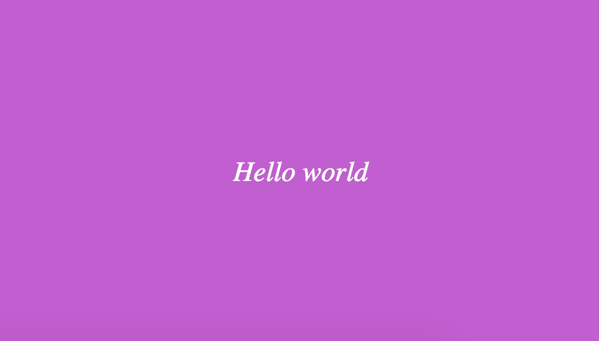

## typewriter

[]()
[]()
[]()
[](https://david-dm.org/michaelbazos/typewriter)


### Description 

Typewriter-style component for your web applications

### Demo

https://jsfiddle.net/tufwnvs7



### Usage

_1. Include the script_

    <script src="https://unpkg.com/@webcomponent/typewriter@1.0.0/dist/typewriter.js"></script>

_2. Use_

```html
Hello <web-typewriter words='["world", "girls", "guys", "friends", "foes"]'></web-typewriter>
```

### License

MIT